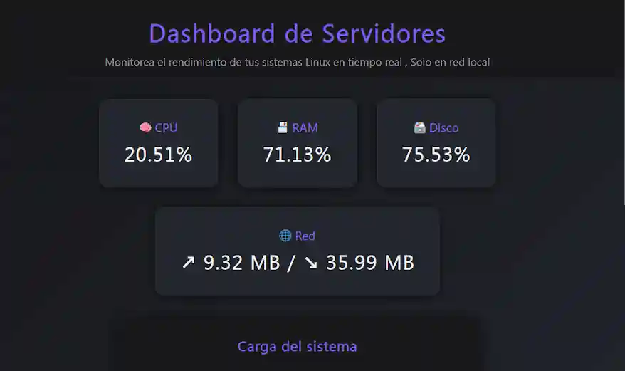

# Monito-li

Aplicación web que muestra métricas de uso de un servidor Linux (CPU, RAM, procesos, carga, temperatura, etc.) en tiempo real o cuasi-tiempo real. Permite automatizar, visualizar e interactuar con datos técnicos desde un entorno gráfico minimalista y profesional.

---

## Captura

---

## Guía

- Ejecuta `app.py` en el servidor o sistema que quieras monitorear.
- Te dará la ruta `localhost` o `127.0.0.1` si lo ejecutas en tu misma PC.
- Te dará una segunda ruta, por ejemplo: `Running on http://192.168.31.40:5000`, en la que podrás acceder desde otra PC en tu misma red (la IP cambiará según la de tu PC donde lo ejecutes).
- Asegúrate de tener el puerto 5000 libre o permisivo si usas `ufw`.

---

## Testing

- Ubuntu 22
- Debian 12